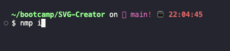
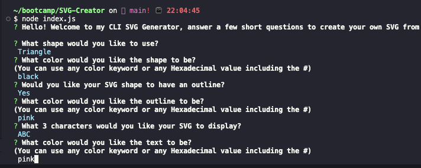
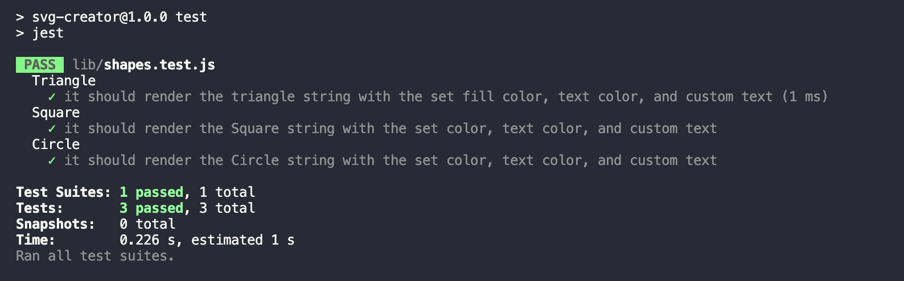

# SVG-Creator 

  [](https://opensource.org/licenses/MIT)

  ## Description
  
  This project was created to help users generate an SVG file for 3 basic shapes. The output file is a 300x200 generated SVG file of a Triangle, Square, or Circle. The file is generated based on the users input. This project aided in furthering my understanding of object oriented programming and gave me a fundamental better understanding of using classes to help my code do more while writitng less. The ability to create and extend classes so that functions can be shared across different constructers proved to be extremely useful. Overall this project challeneged my understanding of this module and helped further cement what I've learned up to this point.
  
  ## Table of Contents
  
  - [Installation](#installation)
  - [Usage](#usage)
  - [Credits](#credits)
  - [License](#license)
  - [Contributions](#how-to-contribute)
  - [Tests](#tests)
  - [Questions](#questions)
  
  ## Installation
  
  Navigate to https://github.com/alexanderolivares13/SVG-Creator <br>and clone the github repository.<br>Then using bash/terminal, navigate into the SVG-Creator folder and run <br> ``` npm i ``` <br> to ensure that you have all the packages required to run the program <br>
  
  ## Usage
  Follow along with instructional video: https://drive.google.com/file/d/1m28pSoHz7KuhNqjZTCnBXqXXHY17drMO/view <br>or<br>
  While still in the SVG-Creator folder, after installing the necessary packages, run <br> ```node index.js``` <br> to invoke the init function and start the program. Simply answer all the provided questions with the instructions to get your SVG file created.<br>
  
  ## Credits
  
  Inquirer NPM Package: https://www.npmjs.com/package/inquirer <br>
  Jest NPM Package: https://www.npmjs.com/package/jest <br>
  The syntax used in the Circle class in the shapes.js file was used from the Module 10 challenge example: https://git.bootcampcontent.com/University-of-Minnesota/UofM-VIRT-FSF-PT-04-2023-U-LOLC-ENTG/-/tree/main/10-OOP/02-Challenge

  ## License

  This project is licensed under the MIT License

  ## How to Contribute
  
  N/A
  
  ## Tests
  
  To run any tests, ensure that you have installed any necessary packages and run the <br> ``` npm test ``` <br> In the SVG-Creator folder using terminal/bash<br>
  

  ## Questions
  
  My work can be found on Github at [alexanderolivares13](https://www.github.com/alexanderolivares13)

  If you have any further questions you can contact me at my email at: [alexander.olivares1310@gmail.com](mailto:alexander.olivares1310@gmail.com)


